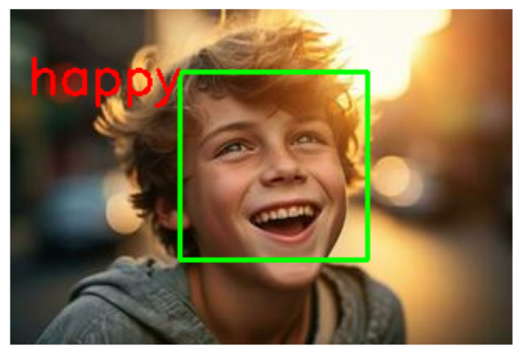

# Face Emotion Detection using CNN

## 📌 Overview
This project implements a Deep Learning based Face Emotion Detection system using Convolutional Neural Networks (CNN). The model predicts human emotions from facial images.

## 🎯 Features
- Real-time emotion detection
- CNN-based deep learning model
- Image preprocessing and normalization
- GUI / Notebook implementation

## 🧠 Technologies Used
- Python
- TensorFlow / Keras
- OpenCV
- NumPy
- Matplotlib

## 📂 Project Structure
Face-Emotion-Detection/
│── dataset/
│── model/
│── main.py / notebook.ipynb
│── README.md

## 🚀 How to Run
1. Install required libraries:
2. Run the main file:

## 📊 Output Example

## 👨‍💻 Author
Your Name: SYED ISMAEL & MUNEER HUSSAIN
